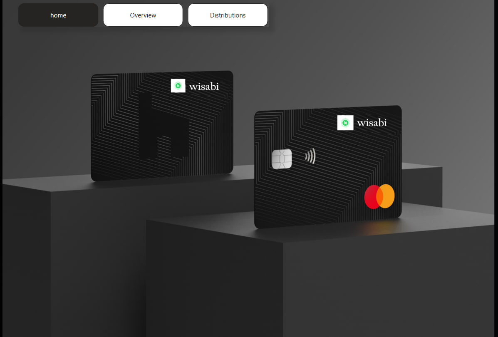
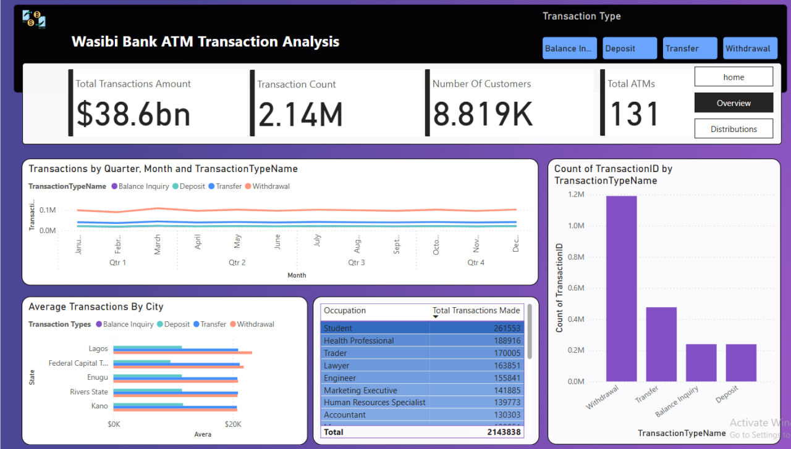
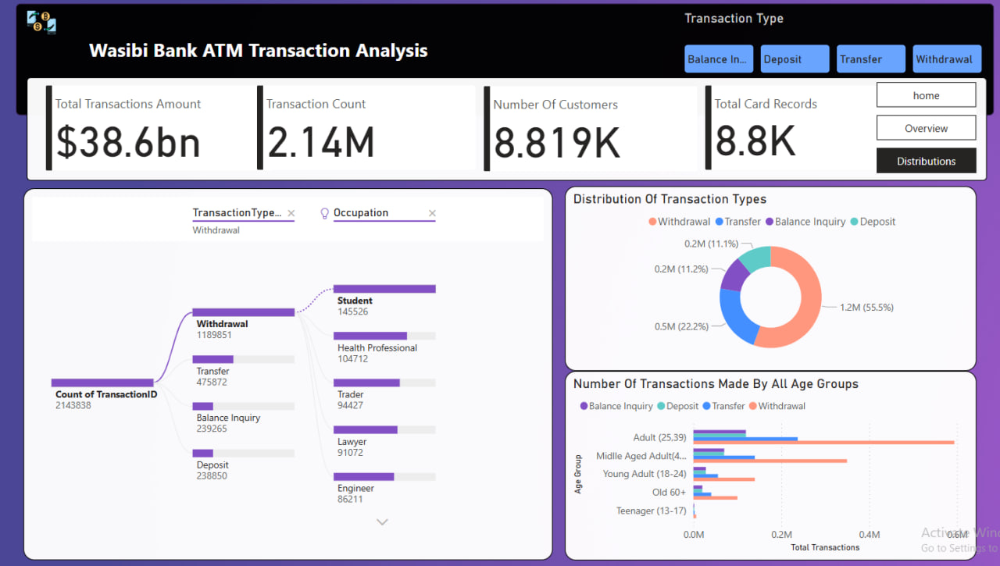

# Wisabi ATM Transaction Analaysis 
### this Project is bulit to analyze Usage preferance of Atms in Specific Country of nigeria

I’ve been working on Wasabi Bank Transaction Analysis , and it has been a fantastic learning experience. This project has helped me turn raw financial data into actionable insights, making it easier to understand customer behaviors and transaction trends.
📌 Transaction Trends – When and where people use ATMs the most
📌 Who is Making Transactions (age, occupation, etc.)
📌 ATM Utilization by State
📌 Types of Transactions Made Most Often (Withdrawals, Transfers, Balance Inquiries, Deposits)
Banks and business owners can use this data to enhance workflows, improve services, and optimize ATM locations. Even though it’s a demo project, I’ve gained valuable insights from the visualizations and learned how data visualization can lead to better financial decision-making.
This demo project was both exciting and a little challenging. I’d love to hear your thoughts! Please comment or react to this post. If you work with financial data or Power BI, let’s connect—how do you bring financial data to life through visualization?
you can find a data on kaggle
#PowerBI #DemoProject #Python #DataAnalytics #DataVisualization #BusinessIntelligence #DashboardDesign
